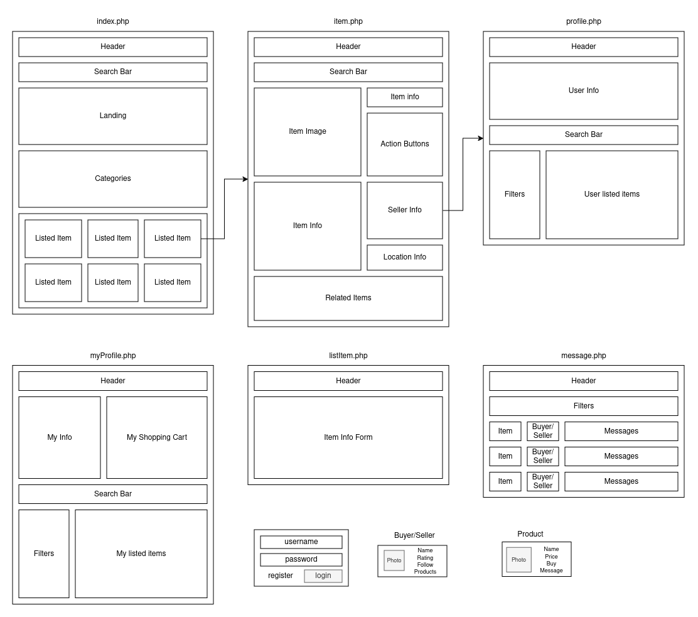

# LTW Project 2024 - 02G06

Website that facilitates the buying and selling of pre-loved items developed in HTML/CSS, PHP, JS and SQLite for the **Web Languages and Technologies (LTW)** course unit **@FEUP**

Project grade: **? / 20**

### This project was developed by:

_Bruno Ferreira_ (up202207863@fe.up.pt)

_Rodrigo Almeida_ (up202206733@fe.up.pt)

_José Mota_ (up201905451@fe.up.pt)

# Initial Mockups

