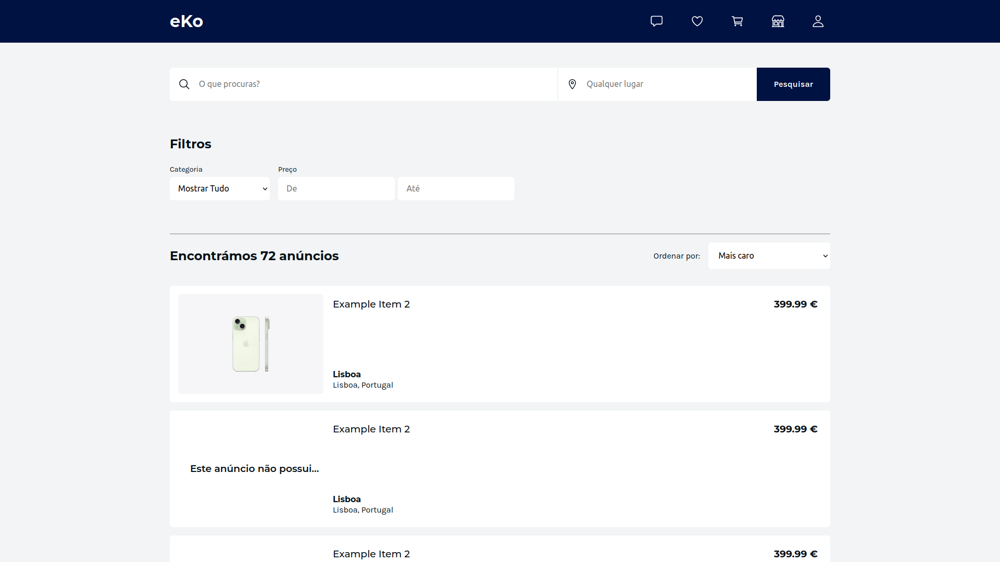
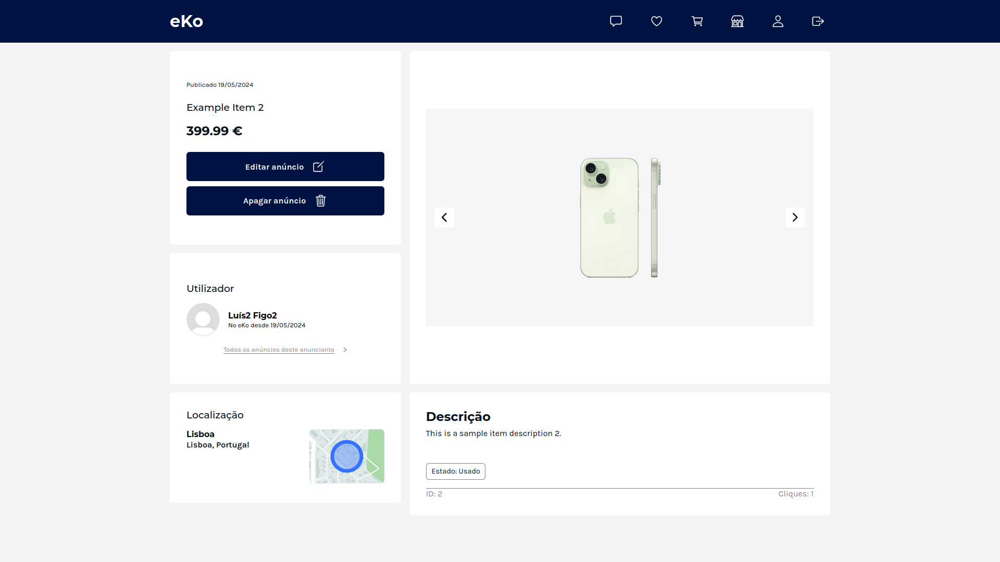
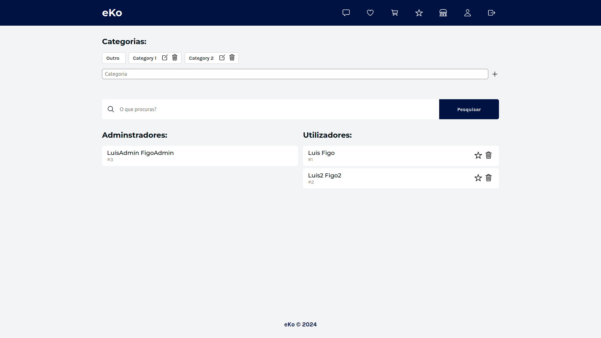
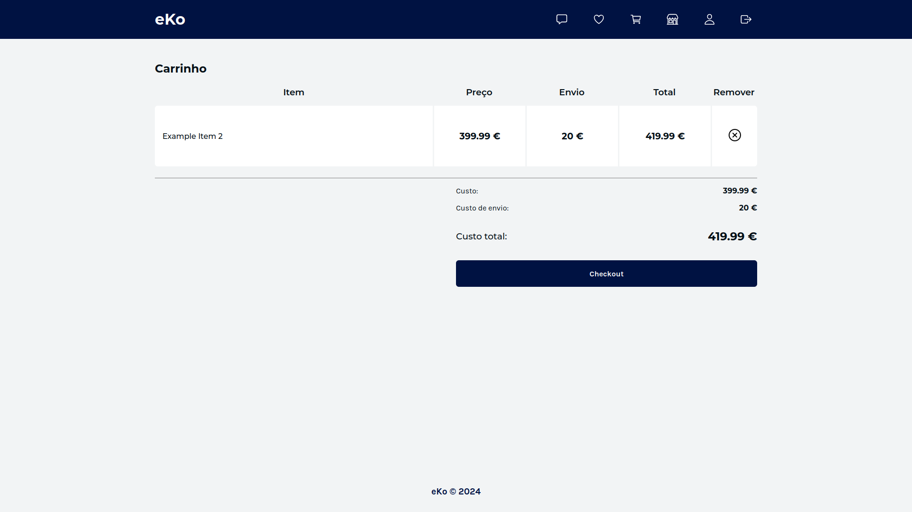
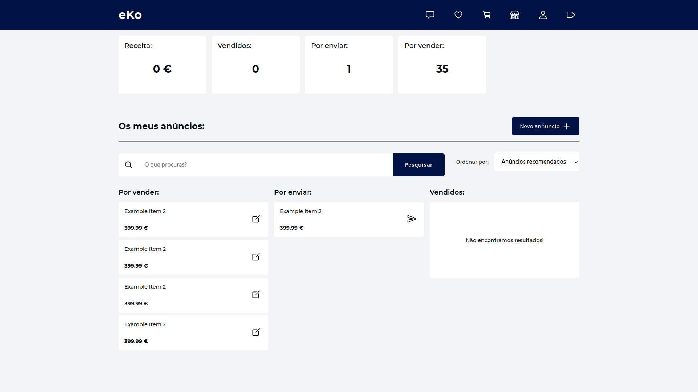

# LTW Project 2024 - 02G06

Website that facilitates the buying and selling of pre-loved items developed in HTML/CSS, PHP, JS and SQLite for the **Web Languages and Technologies (LTW)** course unit **@FEUP**

Project grade: **? / 20**

### This project was developed by:

_Bruno Ferreira_ (up202207863@fe.up.pt)

_Rodrigo Almeida_ (up202206733@fe.up.pt)

_José Mota_ (up201905451@fe.up.pt)

# Initial Mockups

## Install Instructions

    git clone git@github.com:FEUP-LTW-2024/ltw-project-2024-ltw02g06.git

    git checkout final-delivery-v1

    sqlite database/database.db < database/database.sql

    // to populate the database with random values:
    sqlite database/database.db < database/populate.sql

    php -S localhost:9000

## External Libraries

We have used the following external libraries:

- uuidv4

- ion-icon

## Screenshots

## Implemented Features

**General**:

- Register a new account.

- Log in and out.

- Edit their profile, including their name, username, password, and email.

**Sellers** should be able to:

- List new items, providing details such as category, brand, model, size, and condition, along with images.

- Track and manage their listed items.

- Respond to inquiries from buyers regarding their items and add further information if needed.

- Print shipping forms for items that have been sold.

**Buyers** should be able to:

- Browse items using filters like category, price, and condition.

- Engage with sellers to ask questions or negotiate prices.

- Add items to a wishlist or shopping cart.

- Proceed to checkout with their shopping cart (simulate payment process).

**Admins** should be able to:

- Elevate a user to admin status.

- Introduce new item categories, sizes, conditions, and other pertinent entities.

- Oversee and ensure the smooth operation of the entire system.

**Security**:

We have been careful with the following security aspects:

- **SQL injection**

- **Cross-Site Scripting (XSS)**

- **Cross-Site Request Forgery (CSRF)**

**Password Storage Mechanism**: hash_password & verify_password

**Aditional Requirements**:

We also implemented the following additional requirements (you can add more):

- **Analytics Dashboard**

- **API Integration**

- **Shipping Costs**

- **Real-Time Messaging System**

- **Categories have attributes**
